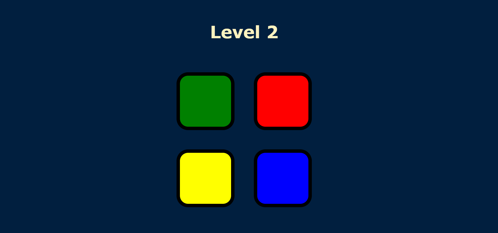

  <h2 align="center">Simon Game</h2>

<!-- ABOUT THE PROJECT -->
## About The Project

* This game is a web-based version of the classic "Simon" memory game. When the user presses any key, the game begins, displaying a sequence of colors that the user must memorize and reproduce. 
* Each round, the game adds a new color to the sequence, increasing the level and difficulty. 
* The user clicks on the colored buttons in the correct order, with each button press triggering a corresponding sound and animation. 
* If the user correctly replicates the entire sequence, the game advances to the next level after a brief delay. 
* If the user makes a mistake, a "wrong" sound plays, the screen briefly flashes a "game over" animation, and the level resets. 
*The game continues until the user fails to reproduce the sequence correctly.

### Technology Used

* HTML
* CSS
* JavaScript

### Screenshot

